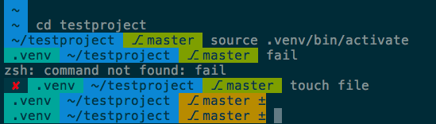

# agnoster-no-powerline.zsh-theme

This is a small modification to [agnoster's excellent zsh theme](https://github.com/agnoster/agnoster-zsh-theme), that looks slightly worse in exchange not requiring the a custom Powerline-patched font to use. I mostly made this becuase I didn't like the fact that the copied text from my zsh sessions wasn't portable. It would show up with missing-glyph symbols when you paste it into Slack, Gist, email, etc. This version solves that, and also has the added benefit of not having to install a custom font to use: it works with zsh out of the box.

The only change from the original is that it gets rid of the fancy arrow separator, and replaces the branch symbol with "⎇" (U+2387 ALTERNATIVE KEY SYMBOL). All the other symbols were already standard Unicode, surprisingly.

Here's what it looks like in macOS Terminal.app, with Menlo and the Solarized Dark theme:

